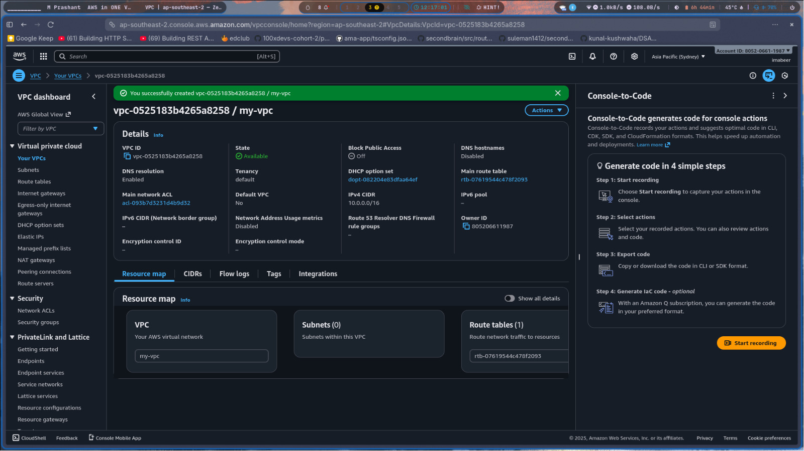
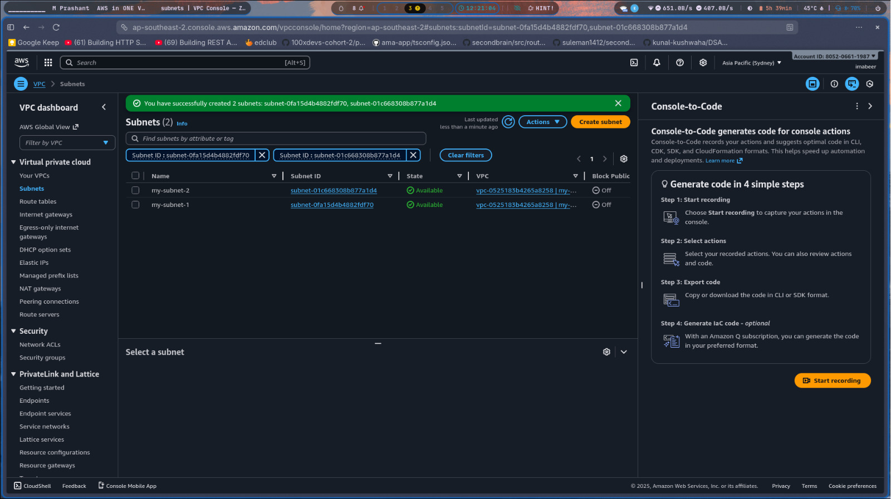
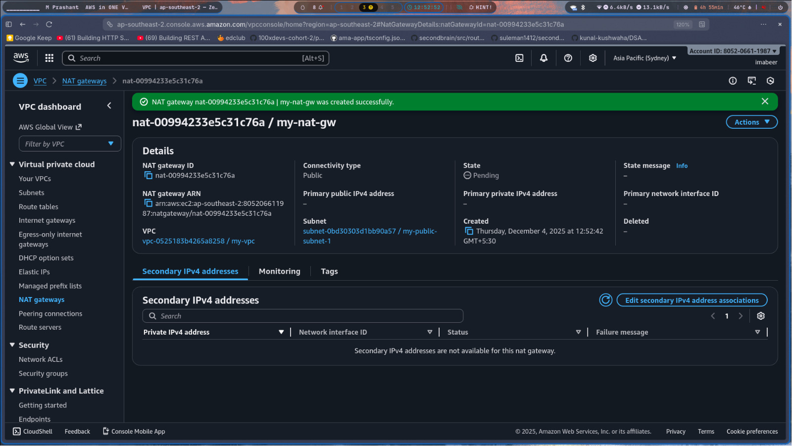
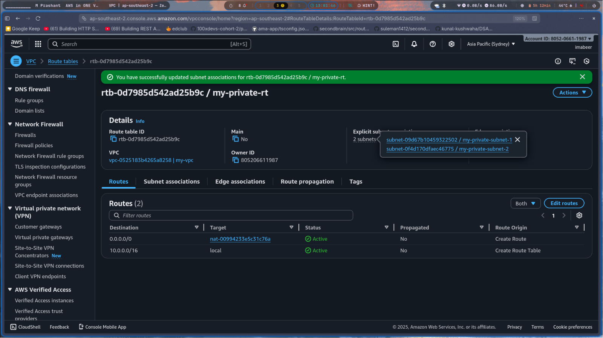
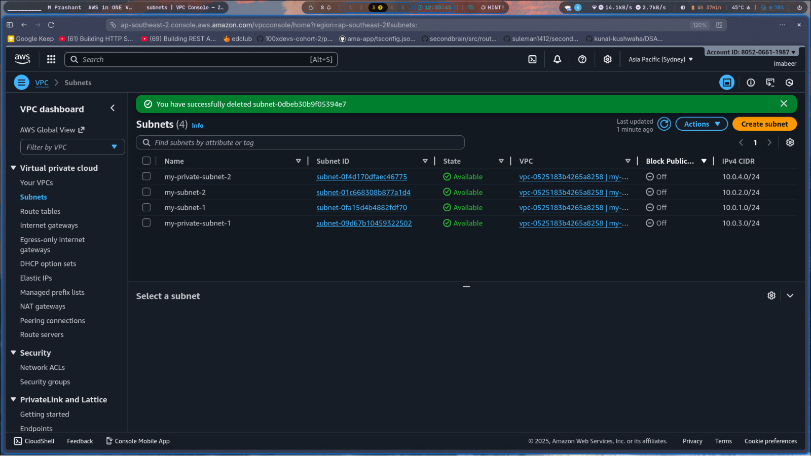

# AWS Assessment – Question 1  
## Networking & Subnetting (AWS VPC Setup)

This project implements a basic AWS network infrastructure using VPC, public/private subnets, an Internet Gateway, a NAT Gateway, and route tables.  
The configuration is designed using AWS best practices and fully automated using Terraform.

---

# 📌 1. Overview / Approach

I created a VPC with CIDR `10.0.0.0/16`, allowing a scalable private IP range.  
The address space was divided into **two public** and **two private subnets**, each `/24`, spread across different Availability Zones for high availability.  
An **Internet Gateway** provides internet access to public subnets, while a **NAT Gateway** in Public Subnet 1 enables secure outbound access for instances in private subnets.  
Separate **public and private route tables** ensure proper traffic routing.  
All resources were additionally provisioned using Terraform for repeatability and automation.

---

# 📌 2. Architecture Diagram  
*(Add a diagram screenshot here if you want; optional but recommended)*


---

# 📌 3. AWS Screenshots (Evidence)

### 🔹 **VPC**


### 🔹 **Subnets**


### 🔹 **Internet Gateway**


### 🔹 **NAT Gateway**


### 🔹 **Route Tables**
#### Public Route Table


#### Private Route Table


---

# 📌 4. CIDR Block Design & Justification

| Component | CIDR Range | Reason |
|----------|------------|--------|
| **VPC** | `10.0.0.0/16` | Large address space allowing subnet expansion |
| **Public Subnet 1** | `10.0.1.0/24` | Dedicated public zone for internet-facing resources |
| **Public Subnet 2** | `10.0.2.0/24` | AZ redundancy for public workloads |
| **Private Subnet 1** | `10.0.3.0/24` | Application tier without public exposure |
| **Private Subnet 2** | `10.0.4.0/24` | Redundant private tier for backend services |

This follows AWS recommended practices of designing **isolated public & private layers** with NAT-based secure outbound access.

---

# 📌 5. Terraform Code Location  
The complete Terraform configuration is included here:

➡️ **`question1_vpc_setup/main.tf`**

It provisions:

- VPC  
- Public Subnets  
- Private Subnets  
- Internet Gateway  
- NAT Gateway + Elastic IP  
- Public Route Table + associations  
- Private Route Table + associations  

All resource names match your AWS console setup (e.g., `my-vpc`, `my-subnet-1`, `my-nat-gw`, etc.).

---

# 📌 6. How to Deploy Using Terraform

### **Initialize Terraform**
```bash
terraform init
```

### **Preview Resources Before Deployment**
```
terraform plan
```

### **Create the AWS Infrastructure**
```
terraform apply

```

### **Destroy All Resources (Required After Assessment)**
```
terraform destroy
```